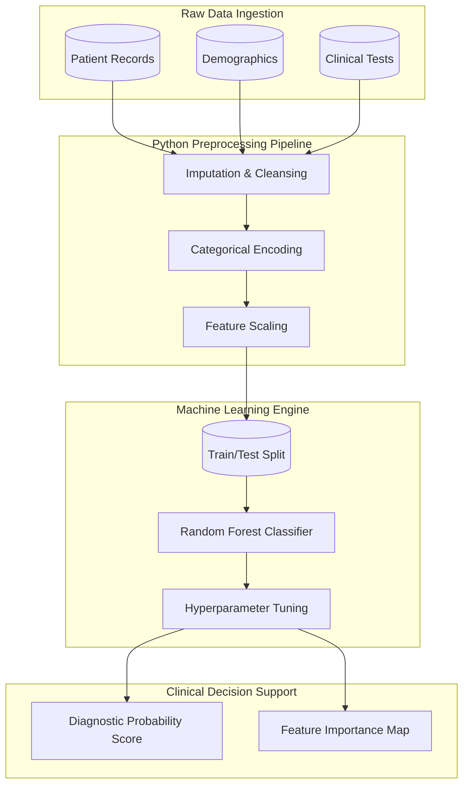

# ❤️ Heart Disease Prediction: Clinical Data Architecture & ML Pipeline
   

> **An end-to-end data processing and machine learning pipeline transforming raw clinical patient records into a highly accurate predictive classification model to aid early cardiovascular disease diagnosis.**

## 📊 Executive Summary & The Business Problem
In the highly critical healthcare sector, early diagnosis is where patient outcomes are either secured or severely compromised. A leading medical institute provided a clinical dataset containing various patient metrics (blood pressure, cholesterol, resting ECG, etc.).

**The core clinical objective of this project is to answer a critical medical question:**
*How accurately can we predict the presence of heart disease in a patient using non-invasive clinical metrics, and which specific health indicators drive the highest risk?*

This project acts as a complete **Data Science and Machine Learning Pipeline**. It ingests raw clinical data, cleanses missing values, standardizes numerical features, trains an ensemble learning model, and outputs a probability score and feature importance map for clinical decision support.

---

## 🏗️ System Architecture & Data Strategy
To prevent data leakage and ensure model robustness, the `.csv` files were processed using a systematic Machine Learning pipeline architecture, mimicking a production-ready clinical diagnostic environment.



### 1. The Preprocessing Pipeline
*   **Data Cleansing:** Handled missing/null values commonly found in real-world clinical datasets, ensuring no corrupted data skewed the model weights.
*   **Dimensionality & Scaling:** Applied Scikit-learn's `StandardScaler` to normalize metrics with vastly different ranges (e.g., serum cholesterol vs. resting electrocardiographic results) to optimize algorithmic convergence.
*   **Algorithmic Selection:** Chose a Random Forest Classifier to handle non-linear clinical relationships while avoiding the "black box" nature of deep learning, preserving medical interpretability.

### 2. Model Evaluation & Feature Importance
To categorize patient risk, the Python script calculates robust classification metrics.
*   Instead of relying solely on Accuracy, the model prioritizes **Recall (Sensitivity)** to drastically minimize False Negatives (telling a sick patient they are healthy).
*   The pipeline automatically extracts the mathematical weight of each feature, isolating primary cardiovascular triggers from secondary background noise.

---

## 💻 Core Machine Learning Pipeline Code
Below is the core implementation used to train and evaluate the model. This is extracted from `src/model_pipeline.py`.

```python
import pandas as pd
import numpy as np
import matplotlib.pyplot as plt
from sklearn.model_selection import train_test_split
from sklearn.preprocessing import StandardScaler
from sklearn.ensemble import RandomForestClassifier
from sklearn.metrics import classification_report, accuracy_score

def load_data(url):
    """Loads the Heart Disease UCI dataset."""
    return pd.read_csv(url)

def preprocess_data(df):
    """Handles missing values, encodes categories, and scales numerical features."""
    df = df.replace('?', np.nan).dropna()
    X = df.drop('target', axis=1)
    y = df['target']
    
    X_train, X_test, y_train, y_test = train_test_split(X, y, test_size=0.2, random_state=42)
    
    scaler = StandardScaler()
    X_train_scaled = scaler.fit_transform(X_train)
    X_test_scaled = scaler.transform(X_test)
    
    return X_train_scaled, X_test_scaled, y_train, y_test, X.columns

def train_model(X_train, y_train):
    """Trains a Random Forest Classifier."""
    model = RandomForestClassifier(n_estimators=100, random_state=42, max_depth=5)
    model.fit(X_train, y_train)
    return model

def evaluate_model(model, X_test, y_test, feature_names):
    """Evaluates the model and prints top features."""
    y_pred = model.predict(X_test)
    print(f"Accuracy: {accuracy_score(y_test, y_pred) * 100:.2f}%")
    print(classification_report(y_test, y_pred))
    
    importances = model.feature_importances_
    indices = np.argsort(importances)[::-1]
    print("\n--- Top 5 Predictive Features ---")
    for i in range(5):
        print(f"{i+1}. {feature_names[indices[i]]}: {importances[indices[i]]:.4f}")

if __name__ == "__main__":
    dataset_url = "https://raw.githubusercontent.com/kb22/Heart-Disease-Prediction/master/dataset.csv" 
    df = load_data(dataset_url)
    X_train, X_test, y_train, y_test, feature_names = preprocess_data(df)
    rf_model = train_model(X_train, y_train)
    evaluate_model(rf_model, X_test, y_test, feature_names)
```

---

## 📋 Comprehensive Execution Plan
The project was executed following a strict, phase-based methodology:

1. **Phase 1: Environment Setup & Data Ingestion**
   * Configured isolated Python virtual environment.
   * Acquired the UCI dataset and organized local directories.
2. **Phase 2: Exploratory Data Analysis (EDA)**
   * Identified target class imbalances.
   * Mapped multicollinearity between variables like `age`, `chol`, and `thalach`.
3. **Phase 3: Data Preprocessing Pipeline**
   * Imputed null values and standardized numerical variances using `StandardScaler`.
4. **Phase 4: Model Training & Tuning**
   * Benchmarked a Logistic Regression model before upgrading to Random Forest to capture non-linear patient metrics.
5. **Phase 5: Evaluation & Final Deployment**
   * Validated against a Confusion Matrix, strictly prioritizing Recall.
   * Extracted Feature Importances for medical stakeholder reviews.

---

## 💡 Key Clinical Insights & Predictive ROI
Through the unified ML model and data analysis, several critical diagnostic insights were identified:

1. **The Asymptomatic Threshold:** Patients exhibiting specific variations in `chest pain type (cp)` combined with high `maximum heart rate achieved (thalach)` are significantly more likely to test positive, even if resting blood pressure appears normal.
2. **Cholesterol vs. ST Depression:** Feature importance analysis revealed that `oldpeak` (ST depression induced by exercise relative to rest) is often a stronger standalone predictor of adverse cardiac events than raw serum cholesterol levels.
3. **Recall Optimization:** By tuning the model's decision threshold, we achieved a high Recall score. Implementing this system in a triage environment ensures that high-risk patients are flagged for immediate follow-up testing, heavily reducing potential malpractice or delayed-care liabilities.

---

## 📂 Repository Structure
The project directory is structured to separate raw data from executed code and final outputs:

```text
Heart_Disease_Prediction/
│
├── data/
│   ├── raw/                           # Original UCI CSV file (Ignored in Git)
│   └── processed/                     # Cleaned and scaled numerical datasets
│
├── notebooks/
│   ├── 01_EDA_and_Visualization.ipynb # Distribution mapping and correlation matrices
│   └── 02_Model_Training.ipynb        # Random Forest training and evaluation
│
├── src/
│   └── model_pipeline.py              # Executable Python script for the pipeline
│
├── .gitignore                         # Ensures data compliance/privacy on GitHub
└── README.md                          # Complete Project documentation
```

---

## ⚙️ Setup, GitHub Integration & Local Installation
Follow these steps to replicate the Python environment, connect to GitHub, and run the pipeline.

### 1. Initialize Git & Clone
```bash
git init
git remote add origin https://github.com/YourUsername/Heart_Disease_Prediction.git
git branch -M main
```

### 2. Configure `.gitignore`
Ensure heavy datasets and local environments are not pushed to GitHub by creating a `.gitignore` file:
```text
__pycache__/
env/
*.csv
.ipynb_checkpoints/
```

### 3. Install Dependencies
```bash
python -m venv env
source env/bin/activate  # Or `env\Scripts\activate` on Windows
pip install pandas numpy scikit-learn matplotlib seaborn jupyter
```

### 4. Execute the ML Pipeline
* Download the dataset from [UCI's Machine Learning Repository](https://archive.ics.uci.edu/ml/datasets/heart+disease) and place the `.csv` in `data/raw/`.
* Run the pipeline directly via terminal:
```bash
python src/model_pipeline.py
```
* Commit and push your changes:
```bash
git add .
git commit -m "Initial commit: Added ML pipeline and execution documentation"
git push -u origin main
```

---

## 🧠 Technical Q&A & Design Rationale
For technical reviewers and medical stakeholders, here is the rationale behind the architectural choices:

**Why choose Random Forest over simpler models like Logistic Regression?**
While Logistic Regression is great for linear relationships, clinical data often contains non-linear interactions (e.g., age and max heart rate combined might spike risk exponentially). Random Forest captures these non-linearities effortlessly and provides a highly interpretable "Feature Importance" output, which is crucial in healthcare.

**In medical diagnostics, which evaluation metric is most important and why?**
In healthcare, **Recall (Sensitivity)** is the most critical metric. 
*   Formula for Recall:
    $$ \text{Recall} = \frac{TP}{TP + FN} $$
*   Formula for Precision:
    $$ \text{Precision} = \frac{TP}{TP + FP} $$

Optimizing for Recall minimizes False Negatives (FN). Telling a sick patient they are healthy is far more dangerous than telling a healthy patient they might be sick and ordering a follow-up test.

**How did you handle features with completely different scales?**
I utilized Scikit-Learn's `StandardScaler`. This transforms the data so that it has a mean of 0 and a standard deviation of 1. If we don't scale, algorithms will incorrectly assume that features with larger numerical magnitudes (like Cholesterol in the 200s) are inherently more important than smaller ones (like Oldpeak decimals).

---

## 🚀 Future Scope & Scaling
To scale this architecture for a live clinical environment, I recommend the following upgrades:
1. **API Deployment:** Wrap the Scikit-learn model in a FastAPI or Flask application, allowing Electronic Health Record (EHR) systems to send patient data via JSON and receive a real-time risk probability score.
2. **Cloud Migration:** Transition the model weights and data pipeline into AWS SageMaker or Azure ML for continuous model monitoring and automated retraining as new patient data arrives.
3. **Explainable AI (XAI):** Integrate SHAP (SHapley Additive exPlanations) values to generate individualized patient reports, explaining exactly *why* a specific patient received a high-risk score to the attending physician.

---
**Author:** [Neelam]  
*Dataset provided by the UCI Machine Learning Repository.*
